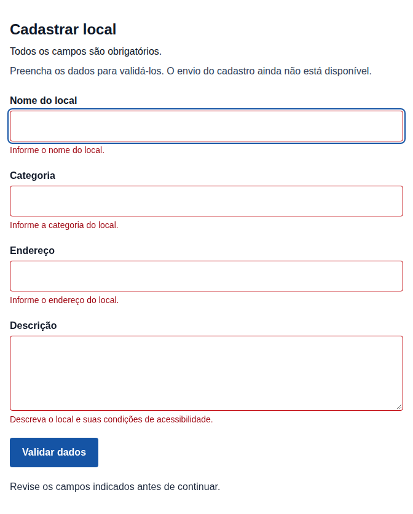
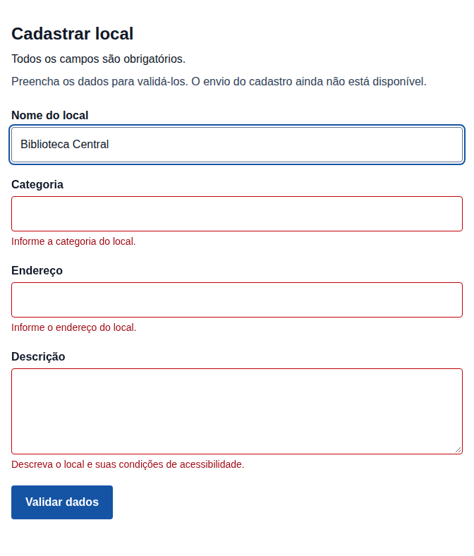

# Evidências visuais da issue #72

Capturas reais do formulário em Chromium, geradas automaticamente com Playwright.
Commit executado: 0b1380eb133ac2335d88a0a02cd997456a6c1921
Execução: https://github.com/1TDSPw-26/portal-locais-acessiveis/actions/runs/37388827409

## Formulário vazio

Ao acionar Validar dados, os quatro campos mostram mensagens específicas e o foco vai para Nome do local.

## Correção de um campo

Após preencher Biblioteca Central, o erro do nome desaparece. Os outros três erros permanecem.

O cadastro apenas valida dados; a persistência depende da futura API.
Captura automatizada com assistência do Codex. Revisão técnica e QA independente permanecem pendentes.
